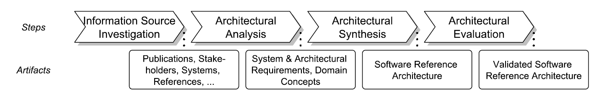

# A Software Reference Architecture for NLP4RE Tools


[](./LICENSE)
[](https://doi.org/10.5281/zenodo.18745248)
<!--[](https://arxiv.org/abs/2401.01154) -->

This repository contains the replication package for the study titled "A Software Reference Architecture for Natural Language Processing Tools in Requirements Engineering", submitted for review at the 34th IEEE International Requirements Engineering Conference.



## Author and Article Details

Author information is omitted to comply with [double-blind review requirements](https://conf.researchr.org/track/RE-2026/RE-2026-Research-Papers#instructions-for-the-double-blind-review-process).

*Cite this work as:* <*Citation omitted to comply with double-blind review requirements.*>
>

## Description of Artifacts

This repository contains the following files:

```
├── figures/  
│   ├── airera-roadmap.pdf         # Illustration of the applied research method (PDF)  
│   └── airera-roadmap.png         # Illustration of the applied research method (PNG)  
├── process/                       # Materials for each step of the SRA creation process (per Nakagawa et al.)  
│   ├── 1 - information source identification/  
│   │   └── Related Work.xlsx      # Tabular overview of related scientific publications and resources  
│   ├── 2 - architectural analysis/  
│   │   ├── analysis-process.md    # Step-by-step process description of architectural analysis  
│   │   └── Requirements.xlsx      # System and architectural requirements with traceability  
│   ├── 3 - architectural synthesis/  
│   │   ├── synthesis-process.md   # Process description of architectural synthesis  
│   │   ├── airera-module-view.pdf           # Module view diagram  
│   │   ├── airera-soa-view.pdf              # SOA component-and-connector view diagram  
│   │   ├── airera-coc-view-paf.pdf          # Pipe-and-filter component-and-connector diagram  
│   │   └── (other supporting artifacts)  
│   └── 4 - architectural evaluation/  
│       ├── evaluation-process.md            # Process description of architectural evaluation  
│       ├── architectural alignment/         # Empirical evaluation data and annotation guidelines  
│       ├── technology acceptance/           # Survey instrument and supporting docs  
│       └── (other supporting artifacts)  
└── LICENSE              # License file clarifying reuse of this material
```

## License

Copyright © 2025 ANONYMOUS.
This work is licensed under [MIT License](./LICENSE).

[^1]: Nakagawa, E. Y., Guessi, M., Maldonado, J. C., Feitosa, D., & Oquendo, F. (2014, April). Consolidating a process for the design, representation, and evaluation of reference architectures. In 2014 IEEE/IFIP Conference on Software Architecture (pp. 143-152). IEEE.
[^2]: Use the "Cite this Repository"-function on GitHub based on the CITATION.cff file.